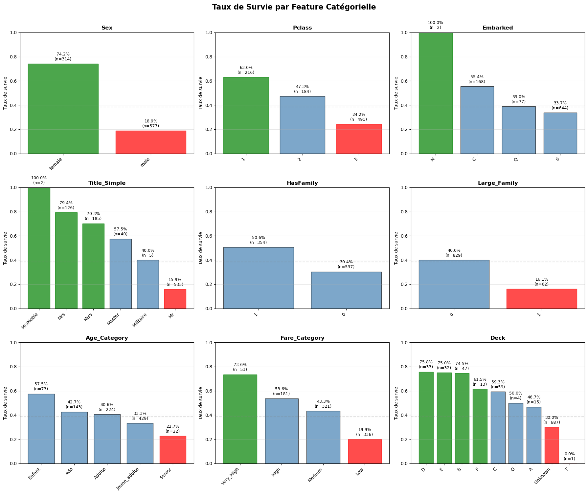
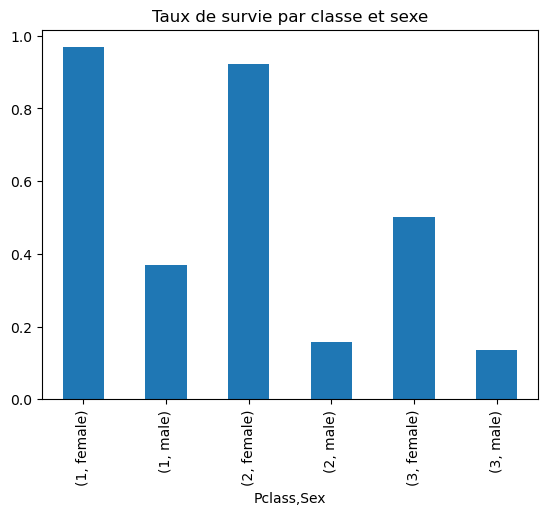

# 🚢 Titanic Survival Prediction

A comprehensive Machine Learning analysis and modeling project to predict Titanic passenger survival.

**Kaggle Score: 78.7% (Top 15% - Rank 2,146/14,636)**


---

## 📊 Project Summary

This project explores the famous Kaggle Titanic dataset with a methodical approach:
- Complete exploratory data analysis (EDA)
- Advanced feature engineering
- Comparison of multiple models
- Ensemble methods and optimization

**Final result: 78.7% accuracy, Top 15% ranking**

---

## 🎯 Objectives

1. Understand survival factors (class, sex, age, family)
2. Create relevant features (title extraction, family size, interactions)
3. Test and compare multiple ML algorithms
4. Optimize through ensemble methods

---

## 📁 Project Structure
```
titanic-survival-prediction/
│
├── 01_TitanicEDA.ipynb           # Data exploration
├── 02_ML_Training.ipynb          # Model training
│
├── data/                         # Datasets
├── images/                       # Visualizations
├── models/                       # Saved models
└── submissions/                  # Kaggle submission files
```

---

## 🔍 Key Insights

### 1. Sex is the Primary Factor
- **Women**: 74% survival rate
- **Men**: 19% survival rate
- Confirms the "Women and children first" protocol

)

### 2. Social Class Plays a Major Role
- **1st Class**: 63% survival
- **2nd Class**: 47% survival
- **3rd Class**: 24% survival

### 3. Sex × Class Interaction
- **1st Class Women**: 97% survival
- **3rd Class Women**: 50% survival
- **Men (all classes)**: <20% survival



### 4. Family Size (Non-Linear Pattern)
- **Alone**: 30% survival
- **Small families (2-4)**: 50-60% survival
- **Large families (5+)**: 16% survival (especially in 3rd class)

---

## 🛠️ Feature Engineering

### Features Created

1. **Title_Simple** (6 categories)
   - Extracted from `Name`
   - Grouped rare titles
   - Encodes age + sex + social status

2. **FamilySize** = SibSp + Parch + 1

3. **HasFamily, IsAlone, Large_Family** (binary flags)

4. **Fare_Per_Person** = Fare / FamilySize

5. **Woman_or_Child** (lifeboat priority)

6. **Age_Was_Missing** (imputation flag)

7. **Interactions**: Sex × Pclass, Age × Pclass, etc.

### Missing Value Imputation
- **Age** (19.9% missing): Group mean (Pclass × Title)
- **Cabin** (77% missing): Has_Cabin flag + Deck extraction
- **Embarked** (0.2% missing): Mode (most frequent)

---

## 🤖 Models Tested

| Model | Test Accuracy | ROC-AUC | Notes |
|-------|--------------|---------|-------|
| **Baseline** | 61.45% | 0.500 | Simple majority |
| **Logistic Regression** | 84.36% | 0.876 | With interactions |
| **Random Forest (initial)** | 80.45% | 0.864 | Overfitting: 11.5% |
| **Random Forest (tuned)** | 83.80% | 0.859 | Overfitting: 2.2% ✅ |
| **XGBoost** | 81.56% | 0.846 | |
| **Gradient Boosting** | 82.5% | 0.855 | |
| **Ensemble (Voting)** | 84.1% | 0.870 | |
| **Ensemble 2 (Weighted)** | **78.7%** | - | **Kaggle Final** |

### Best Model

**Weighted Ensemble** (9 models)
- Random Forest, XGBoost, Gradient Boosting
- Logistic Regression with interactions
- Soft/Hard Voting
- **Kaggle Score: 78.7%**

---

## 📈 Results

### Cross-Validation
- **10-Fold CV**: 82.5% ± 2.1%
- **Stratified** to preserve class distribution

### Kaggle Leaderboard
- **Public Score**: 78.708%
- **Rank**: 2,146 / 14,636 (Top 14.7%)
- **Percentile**: Top 15%

*After removing the 100% scores from obvious cheaters. ;-)*


---

## 🚀 How to Use This Project

### 1. Clone the Repository
```bash
git clone https://github.com/steneze/titanic-survival-prediction.git
cd titanic-survival-prediction
```

### 2. Install Dependencies
```bash
pip install -r requirements.txt
```

### 3. Launch Notebooks
```bash
jupyter notebook
# Open 01_TitanicEDA.ipynb
```

### 4. Train Models
```bash
# Run 02_ML_Training.ipynb
```

---

## 📦 Technologies Used

- **Python 3.12**
- **Pandas**: Data manipulation
- **NumPy**: Numerical computing
- **Scikit-learn**: ML models
- **XGBoost**: Gradient Boosting
- **Matplotlib / Seaborn**: Static visualizations
- **Plotly**: Interactive visualizations

---

## 📚 Resources

- [Kaggle Competition](https://www.kaggle.com/c/titanic)
- [Encyclopedia Titanica](https://www.encyclopedia-titanica.org/)
- [Scikit-learn Documentation](https://scikit-learn.org/)

---

## 🎓 Key Learnings

1. **Feature Engineering > Model Choice**
   - Created features (Title, interactions) had more impact than choosing RF vs XGB

2. **Overfitting is Real**
   - Local CV: 82% vs Kaggle: 78% = -4 points
   - Strict regularization required

3. **Ensemble Requires Diversity**
   - 9 similar models → No gain
   - Need truly different models

4. **Domain Knowledge is Crucial**
   - "Women and children first" → Woman_or_Child feature
   - Historical context guides feature engineering

---

## 👤 Author

**Stéphane Tenèze**
- GitHub: [@steneze](https://github.com/steneze)
- LinkedIn: [Stéphane Tenèze](https://www.linkedin.com/in/st%C3%A9phane-ten%C3%A8ze-b84967/)
- Kaggle: [Stéphane Tenèze](https://www.kaggle.com/stphanetenze)

---

## 🙏 Acknowledgments

- Kaggle for the dataset and platform
- The Kaggle community for valuable discussions

---

⭐ **If you found this project helpful, please consider giving it a star!** ⭐