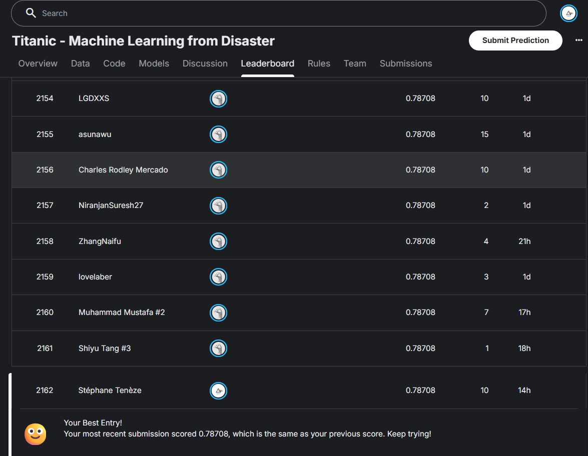

# 🚢 Titanic Survival Prediction

Analyse complète et modélisation Machine Learning pour prédire la survie des passagers du Titanic.

**Score Kaggle : 78.7% (Top 15% - Rang 2146/14636)**



---

## 📊 Résumé du Projet

Ce projet explore le célèbre dataset Titanic de Kaggle avec une approche méthodique :
- Analyse exploratoire complète (EDA)
- Feature engineering avancé
- Comparaison de multiples modèles
- Ensembling et optimisation

**Résultat final : 78.7% d'accuracy, classement Top 15%**

---

## 🎯 Objectifs

1. Comprendre les facteurs de survie (classe, sexe, âge, famille)
2. Créer des features pertinentes (titre, taille famille, interactions)
3. Tester et comparer plusieurs algorithmes ML
4. Optimiser via ensembling

---

## 📁 Structure du Projet
```
├── 01_EDA.ipynb              # Exploration des données
├── 02_ML_Training.ipynb      # Entraînement des modèles
├── data/                          # Datasets
├── images/                        # Images
├── models/                        # Modèles sauvegardés
└── submissions/                   # Fichiers Kaggle

```

---

## 🔍 Insights Clés

### 1. Le Sexe est le Facteur Principal
- **Femmes** : 74% de survie
- **Hommes** : 19% de survie
- Confirme la règle "Women and children first"


### 2. La Classe Sociale Joue un Rôle Majeur
- **1ère classe** : 63% de survie
- **2ème classe** : 47% de survie
- **3ème classe** : 24% de survie

### 3. Interaction Sexe × Classe
- **Femmes 1ère classe** : 97% de survie
- **Femmes 3ème classe** : 50% de survie
- **Hommes toutes classes** : <20% de survie


### 4. Taille de Famille (Pattern Non-Linéaire)
- **Seuls** : 30% de survie
- **Familles 2-4** : 50-60% de survie
- **Grandes familles (5+)** : 16% de survie (surtout classe 3)

---

## 🛠️ Feature Engineering

### Features Créées

1. **Title_Simple** (6 catégories)
   - Extraction depuis `Name`
   - Regroupement des titres rares
   - Encode âge + sexe + statut social

2. **FamilySize** = SibSp + Parch + 1

3. **HasFamily, IsAlone, Large_Family** (flags binaires)

4. **Fare_Per_Person** = Fare / FamilySize

5. **Woman_or_Child** (priorité canots)

6. **Age_Was_Missing** (flag imputation)

7. **Interactions** : Sex × Pclass, Age × Pclass, etc.

### Imputation des Valeurs Manquantes
- **Age** (19.9% manquant) : Moyenne par groupe (Pclass × Title)
- **Cabin** (77% manquant) : Flag Has_Cabin + extraction Deck
- **Embarked** (0.2% manquant) : Mode

---

## 🤖 Modèles Testés

| Modèle | Accuracy Test | ROC-AUC | Notes |
|--------|---------------|---------|-------|
| **Baseline** | 61.45% | 0.500 | Majorité simple |
| **Logistic Regression** | 84.36% | 0.876 | Avec interactions |
| **Random Forest (initial)** | 80.45% | 0.864 | Overfitting 11.5% |
| **Random Forest (tuned)** | 83.80% | 0.859 | Overfitting 2.2% ✅ |
| **XGBoost** | 81.56% | 0.846 | |
| **Gradient Boosting** | 82.5% | 0.855 | |
| **Ensemble (Voting)** | 84.1% | 0.870 | |
| **Ensemble 2 (Weighted)** | **78.7%** | - | **Kaggle Final** |

### Meilleur Modèle

**Ensemble Pondéré** (9 modèles)
- Random Forest, XGBoost, Gradient Boosting
- Logistic Regression avec interactions
- Voting soft/hard
- **Score Kaggle : 78.7%**

---

## 📈 Résultats

### Cross-Validation
- **10-Fold CV** : 82.5% ± 2.1%
- **Stratifiée** pour préserver la distribution

### Kaggle Leaderboard
- **Precision Score** : 78.708%
- **Rang** : 2156 / 14684 (Top 14.7%)
- **Percentile** : Top 15%

Top 12 % after removing the 100% scores, obvious cheaters. ;-)


---

## 📦 Technologies Utilisées

- **Python 3.12**
- **Pandas** : Manipulation des données
- **NumPy** : Calculs numériques
- **Scikit-learn** : Modèles ML
- **XGBoost** : Gradient Boosting
- **Matplotlib / Seaborn** : Visualisations statiques
- **Plotly** : Visualisations interactives

---

## 📚 Ressources

- [Kaggle Competition](https://www.kaggle.com/c/titanic)
- [Encyclopedia Titanica](https://www.encyclopedia-titanica.org/)
- [Scikit-learn Documentation](https://scikit-learn.org/)

---

## 🎓 Key Teachings

1. **Feature Engineering >> Choix du Modèle**
   - Les features créées (Title, interactions) ont plus d'impact que le choix entre RF/XGB

2. **L'Overfitting est Réel**
   - CV local 82% vs Kaggle 78% = -4 points
   - Régularisation stricte nécessaire

3. **Ensembling Nécessite Diversité**
   - 9 modèles similaires → Pas de gain
   - Nécessite modèles vraiment différents

4. **Domain Knowledge Crucial**
   - "Women and children first" → Feature Woman_or_Child
   - Contexte historique guide feature engineering

---

## 👤 Auteur

Stéphane Tenèze
- GitHub: steneze(https://github.com/steneze)
- LinkedIn: Stéphane Tenèze(https://www.linkedin.com/in/st%C3%A9phane-ten%C3%A8ze-b84967/)
- Kaggle: Stéphane Tenèze(https://www.kaggle.com/stphanetenze)

---

## 🙏 Remerciements

- Kaggle pour le dataset et la plateforme

---

⭐ **Si ce projet vous a été utile, n'hésitez pas à mettre une étoile !** ⭐